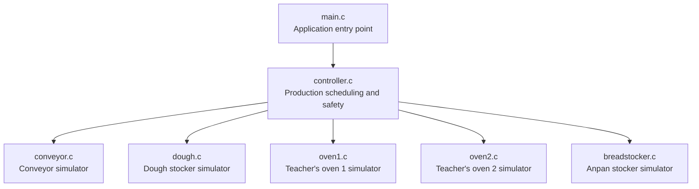
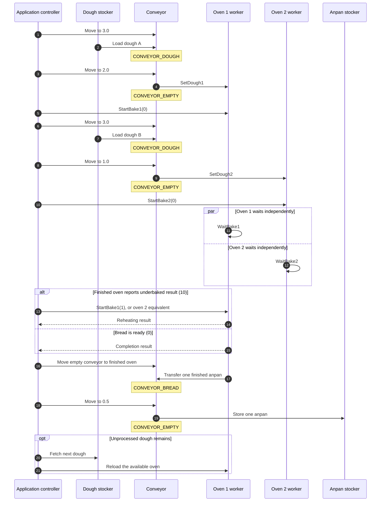
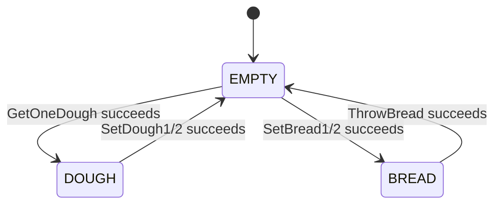
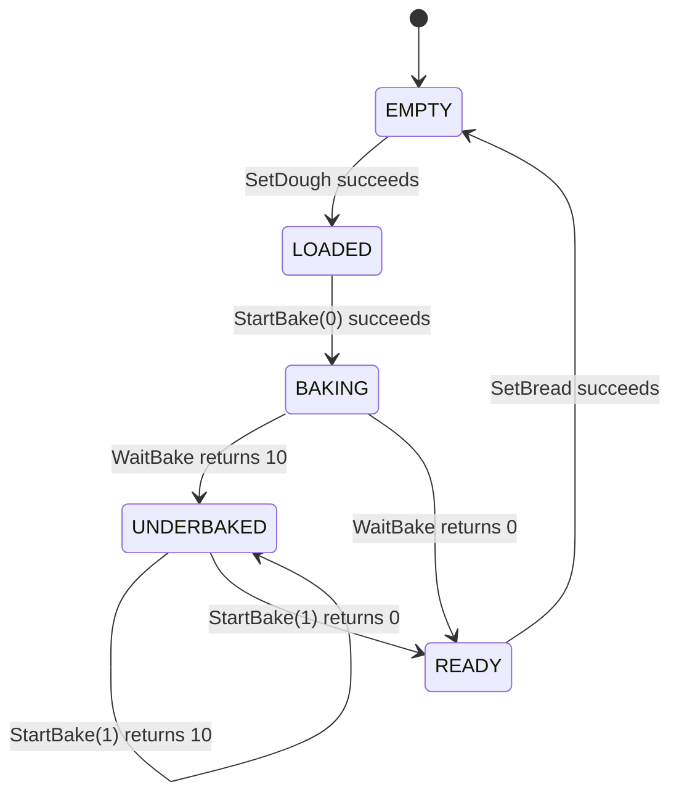

# Anpan Manufacturing Application - Project Documentation

## 1. Purpose

This application controls the teacher-provided anpan manufacturing simulator.
Its objectives are to:

- process every piece of dough delivered in each 12-position AGV refill;
- use oven 1 and oven 2 concurrently to increase production speed;
- guarantee that the conveyor carries no more than one item;
- prevent commands that could move the conveyor outside its safe range;
- reheat underbaked bread using low heat; and
- store every successfully baked anpan in the anpan stocker.

The application changes only the software-control layer. The teacher-provided
hardware simulator modules are treated as fixed hardware interfaces. Minimal
reference-package syntax and API corrections required for compilation are
recorded in `BUG_REPORT.md`; they do not redesign hardware behavior.

## 2. System architecture



Only `controller.c` schedules physical operations. Oven worker threads may wait
for baking and perform reheating, but they never operate the conveyor.

## 3. Hardware positions and constraints

| Component | Coordinate | Allowed range used by simulator |
|---|---:|---:|
| Dough stocker | 3.0 | 2.98 to 3.02 |
| Oven 1 | 2.0 | 1.98 to 2.02 |
| Oven 2 | 1.0 | 0.98 to 1.02 |
| Anpan stocker | 0.5 | 0.48 to 0.52 |
| Conveyor safety range | - | 0.0 to less than 3.5 |

The requirements state that the conveyor breaks at a coordinate below `0.0` or
at least `3.5`. The application therefore rejects such targets before calling
the simulator.

## 4. Source-file explanation

### 4.1 `main.c` - application entry point

`main()` validates the optional production-target argument, prints a start
message, and calls `RunProduction(target_count)`. The default target is 12.

- A nonnegative return value is the number of successfully stored anpan.
- A negative return value means that production stopped because of an error.
- Scheduling details are intentionally kept out of `main.c` so that the entry
  point remains simple.

### 4.2 `controller.h` - application interface

Declares:

```c
int RunProduction(int target_count);
```

This is the public entry point of the application-control module. A positive
value is the exact number of anpan to produce. Zero requests continuous
operation.

### 4.3 `controller.c` - production controller

This file contains the new application logic.

#### Constants

- `POS_DOUGH_STOCKER`: dough stocker coordinate, `3.0`.
- `POS_OVEN1`: oven 1 coordinate, `2.0`.
- `POS_OVEN2`: oven 2 coordinate, `1.0`.
- `POS_BREAD_STOCKER`: finished-anpan stocker coordinate, `0.5`.
- `MOVE_STEP`: maximum target change for a single conveyor command, `1.0`.
- `POSITION_TOLERANCE`: application arrival tolerance, `0.01`.
- `OVEN_COUNT`: number of available ovens, `2`.

#### `ConveyorLoad`

The application explicitly records what is on the conveyor:

```text
CONVEYOR_EMPTY
CONVEYOR_DOUGH
CONVEYOR_BREAD
```

Every loading and unloading function checks this state. This implements the
requirement that only one dough or one anpan may be present on the conveyor.

#### `OvenJob`

Stores the runtime information for one oven:

- oven number;
- whether an oven job is active;
- whether baking has finished;
- the result returned by the oven; and
- the worker-thread identifier.

#### Oven API adapters

The following small functions select oven 1 or oven 2 based on an oven number:

- `start_bake()` calls `StartBake1()` or `StartBake2()`;
- `wait_bake()` calls `WaitBake1()` or `WaitBake2()`;
- `set_dough()` calls `SetDough1()` or `SetDough2()`;
- `set_bread()` calls `SetBread1()` or `SetBread2()`; and
- `oven_position()` returns coordinate `2.0` or `1.0`.

These adapters prevent the controller from duplicating the complete production
logic for each oven.

#### `move_conveyor(double target)`

Moves the conveyor safely to a requested coordinate.

1. Reads the current conveyor position.
2. Divides a long journey into targets no more than `MOVE_STEP` apart.
3. Rejects any intermediate target below `0.0` or at least `3.5`.
4. Calls `StartConveyor()` for each intermediate target.
5. Continues until the conveyor is within the application tolerance.
6. Returns `0` for success and `-1` for failure.

The smaller movements reduce the risk of controller overshoot near the
conveyor's physical limits.

#### `retry_positioned_operation()`

Calls a position-sensitive hardware operation up to three times. If an attempt
fails, it commands the conveyor to the required coordinate again before the
next attempt. This compensates for the simulated position noise.

#### `fetch_dough()`

1. Confirms that the conveyor is empty.
2. Moves to the dough stocker.
3. calls `GetOneDough()` with position retries.
4. Changes the conveyor state to `CONVEYOR_DOUGH` only after successful loading.

#### `load_oven(int oven)`

1. Confirms that one dough is on the conveyor.
2. Moves to the selected oven.
3. Calls the oven's `SetDough` function.
4. Marks the conveyor empty after the dough enters the oven.
5. Starts normal baking by calling `StartBake(0)`.

#### `store_bread_from_oven(int oven)`

1. Confirms that the conveyor is empty.
2. Moves to the selected oven.
3. Calls `SetBread` to transfer the finished anpan to the conveyor.
4. Changes the conveyor state to `CONVEYOR_BREAD`.
5. Moves to the anpan stocker.
6. Calls `ThrowBread()`.
7. Marks the conveyor empty after successful storage.

#### `oven_worker(void *argument)`

Runs separately for each active oven.

1. Calls the teacher's blocking `WaitBake` function.
2. If the function returns `10`, calls `StartBake(1)` for low-heat reheating.
3. Repeats reheating if the result is still `10`.
4. Records the final result.
5. Signals the main controller that an oven is ready.

The worker never uses the conveyor. Therefore, oven concurrency cannot place
two items on the conveyor.

#### `start_oven_job()`

Initializes an oven job and creates its worker thread. The thread begins the
blocking bake wait for that oven.

#### `any_active()`

Returns true while at least one oven has an active job.

#### `select_finished_oven()`

The condition variable puts the controller to sleep until either oven finishes.
Each worker records a monotonic completion timestamp. If both ovens are ready,
the controller selects the earlier timestamp; an exact tie gives oven 1
priority. It does not poll and therefore avoids unnecessary CPU use.

#### `produce_batch(int total)`

Coordinates all dough within one AGV refill:

1. Loads oven 1 and oven 2 when dough is available.
2. Starts one waiting worker for each loaded oven.
3. Sleeps until either oven reports completion.
4. Joins the completed worker.
5. Checks its result.
6. Unloads and stores bread from the earliest-ready oven.
7. Immediately refills that same oven if more production is committed.
8. Repeats until all dough in that refill has been processed.

#### `RunProduction(int target_count)`

1. Initializes the conveyor once.
2. Calls `InitDough()` for each AGV refill.
3. Reads the refill quantity with `GetDoughCount()`.
4. Requests another refill if the AGV supplies no dough.
5. Limits each batch to the remaining target so production cannot overshoot.
6. Calls `produce_batch()` and accumulates the production total.
7. Stops at the exact positive target, or repeats continuously when the target
   is zero.

The default command-line target is exactly 12 anpan. Continuous production must
be selected explicitly.

### 4.4 `conveyor.c` and `conveyor.h` - conveyor simulator

Teacher/simulator API used by the application:

- `InitConveyor()` initializes position-control variables and the random noise.
- `GetPosConveyor()` returns the current position with simulated sensor noise.
- `StartConveyor(target)` performs a blocking controlled movement toward the
  supplied coordinate. It returns a negative value after a failure.

The application does not change the internal conveyor-control equation.

### 4.5 `dough.c` and `dough.h` - dough stocker simulator

- `InitDough()` represents an AGV refill and initializes 12 stocker positions.
  Each position may contain one dough, the quantity changes on each refill, and
  initialization includes a simulated five-second delay.
- `GetDoughCount()` returns the number of available dough pieces.
- `GetOneDough()` transfers one dough to a correctly positioned conveyor and
  decreases the count.

The application supports repeated initialization because the hardware I/F
specification explicitly defines each initialization as an AGV delivery.

### 4.6 `oven1.c`, `oven1.h`, `oven2.c`, and `oven2.h` - teacher's oven simulators

The two ovens expose equivalent APIs:

- `SetDough1/2()` transfers dough from the correctly positioned conveyor into
  an empty oven.
- `StartBake1/2(0)` starts normal baking.
- `WaitBake1/2()` blocks for the simulated baking time and returns `0` for
  normally baked bread, `10` for underbaked bread, or `666` for an invalid
  operation.
- `StartBake1/2(1)` reheats underbaked bread using low heat.
- `SetBread1/2()` transfers ready bread from the oven to the correctly
  positioned conveyor.

The oven `.c` files are kept byte-for-byte identical to the versions in the
supplied ZIP. The compatibility names `KLIN1_MAX` and `KLIN1_MIN` are provided
in `breadmachine.h` because the supplied `oven1.c` uses those names, but the
supplied header defines only `OVEN1_MAX` and `OVEN1_MIN`.

### 4.7 `breadstocker.c` and `breadstocker.h` - anpan stocker simulator

- `ThrowBread()` stores one finished anpan when the conveyor is at coordinate
  `0.5` within the simulator's accepted range.
- The function returns `0` for success and `666` for failure.
- The requirements define the finished-anpan stocker as having unlimited
  capacity, so the application does not maintain a capacity counter.

### 4.8 `breadmachine.h` - shared hardware definitions

Defines the accepted coordinate ranges and conveyor safety limits shared by the
simulator modules. It also provides aliases required by the teacher's oven 1
reference implementation.

### 4.9 `Makefile` - build definition

The Makefile:

- compiles all application and simulator source files;
- enables common compiler warnings;
- uses GNU C11 because the simulator calls POSIX functions;
- links the mathematics library; and
- enables POSIX threading with `-pthread`.

Build and run commands:

```sh
make
./anpan
./anpan 20
./anpan 0
```

The commands produce exactly 12, exactly 20, or a continuous quantity,
respectively.

## 5. Complete production sequence



If both ovens finish at nearly the same time, one waits in its ready state while
the controller uses the single conveyor to service the other. This preserves
the one-item rule.

## 6. Conveyor state transition



Invalid transitions, such as fetching dough while bread is already on the
conveyor, are rejected as safety errors.

## 7. Oven state sequence

The following conceptual states correspond to the teacher's simulator:



## 8. Concurrency and efficiency

The teacher's `WaitBake1()` and `WaitBake2()` functions are blocking calls. If a
single thread calls them sequentially, their full simulated waits are added
together. The improved application creates one worker per active oven, allowing
the waits to overlap.

```text
Sequential waiting:
Oven 1: |---------- wait ----------|
Oven 2:                              |---------- wait ----------|

Concurrent waiting:
Oven 1: |---------- wait ----------|
Oven 2:     |---------- wait ----------|
```

The small horizontal offset represents the time required to deliver the second
dough. Conveyor operations remain sequential even though baking is concurrent.

## 9. Error handling and safety

The application performs the following checks:

- rejects an unsafe conveyor target;
- stops when `StartConveyor()` reports failure;
- retries position-sensitive transfers up to three times;
- prevents loading an occupied conveyor;
- prevents an oven from receiving anything other than dough;
- prevents oven unloading unless the conveyor is empty;
- distinguishes normal completion, underbaking, and invalid API results; and
- returns a failure status to `main()` instead of silently continuing after a
  serious error.

## 10. Requirement traceability

| Requirement | Application response |
|---|---|
| Dough stocker holds at most 12 | Each AGV refill initializes 12 positions and processes the reported count |
| Coordinate-controlled conveyor | All transfers call `move_conveyor()` first |
| Conveyor breaks below 0 or at/above 3.5 | Unsafe targets are rejected before movement |
| Only one item may be on conveyor | Enforced using `ConveyorLoad` state |
| Two ovens bake for a significant period | Independent worker waits overlap |
| Underbaked bread must be reheated at low heat | Worker calls `StartBake(1)` until successful |
| Finished stocker has unlimited capacity | Every completed anpan is stored without a capacity limit |
| Production should be fast | Both ovens are kept active whenever dough is available |
| Hardware must not be changed | Simulator design is preserved; only documented compile/API defects are corrected |

## 11. Four-result scheduling policy

Oven 1 is loaded before oven 2. After that, servicing is event-driven:

| Oven 1 | Oven 2 | Controller action |
|---|---|---|
| Normal | Normal | Service the earlier completion, normally oven 1 |
| Underbaked | Normal | Reheat oven 1; service whichever becomes ready first |
| Normal | Underbaked | Reheat oven 2 while servicing oven 1 |
| Underbaked | Underbaked | Reheat both concurrently; service the first successful completion |

If both completion timestamps are exactly equal, oven 1 wins the deterministic
tie. The selected oven completes one uninterrupted cycle:

```text
unload bread -> store bread -> fetch dough -> reload and restart oven
```

The other finished bread remains safely inside its oven. Dough is never staged
on the conveyor while both ovens are occupied because the conveyor must be
empty for `SetBread1/2()`.

For a target of 12, the controller limits each AGV batch to the remaining
quantity. `loaded` counts committed dough and `produced` counts stored bread, so
no thirteenth dough can be loaded.

## 12. Design conclusion

The design separates hardware simulation from application control. A single
controller owns the conveyor, which makes the one-item safety rule explicit and
easy to review. Independent oven workers overlap the teacher simulator's
blocking bake waits. When an oven becomes ready, the controller stores its bread
and reloads that oven as soon as possible. Configurable AGV refill processing
supports both finite tests and continuous production without changing the
supplied hardware behavior.
